# PRUEBA DE TEMA4 - ENTORNOS DE DESARROLLO
**DOCUMENTACIÓN, OPTIMIZACIÓN Y CONTROL DE VERSIONES**
***Alejandro Carrasco Castellano.***
## EJERCICIO 1
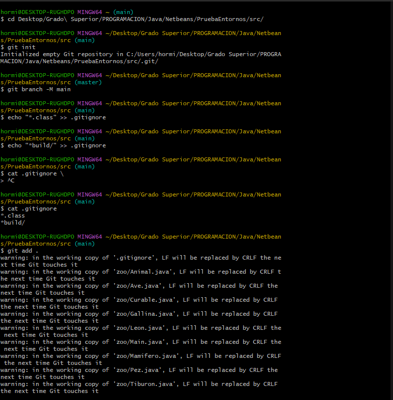
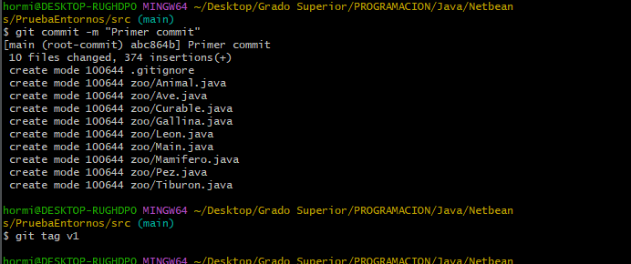
## EJERCICIO 2
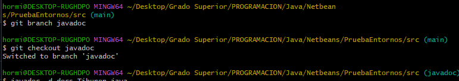
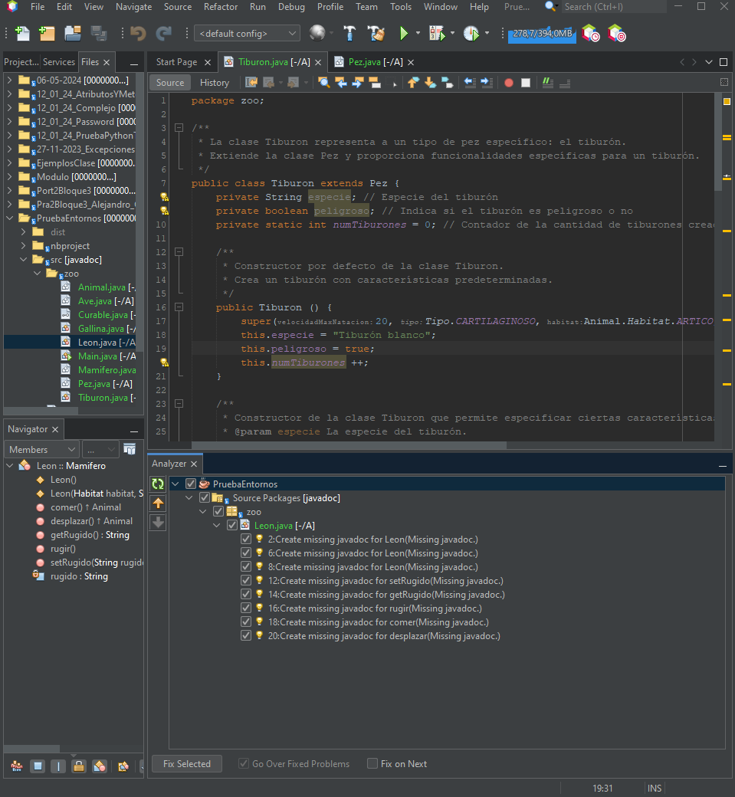
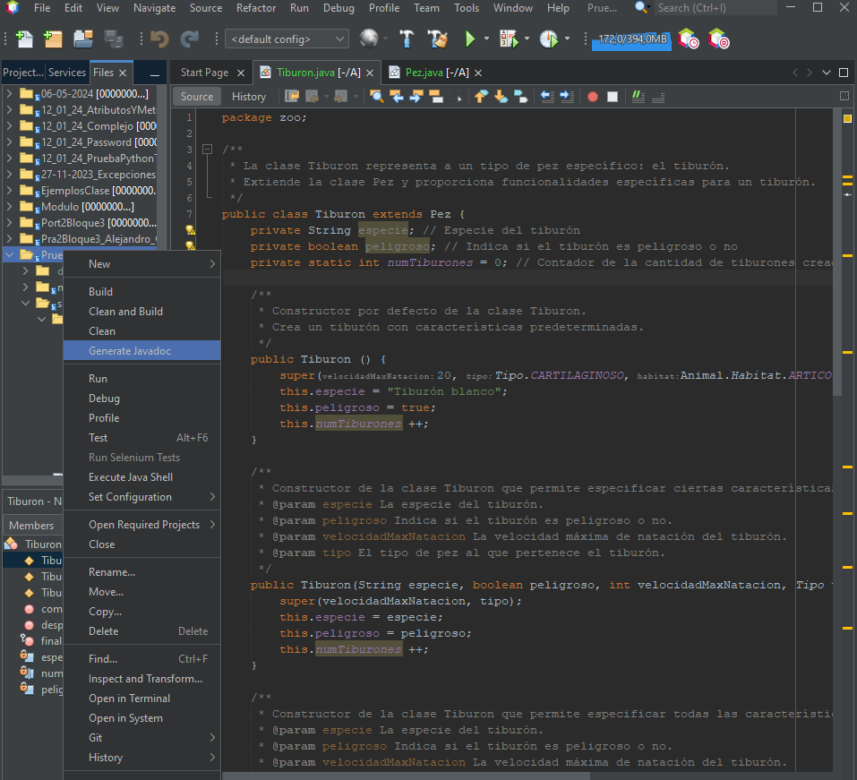
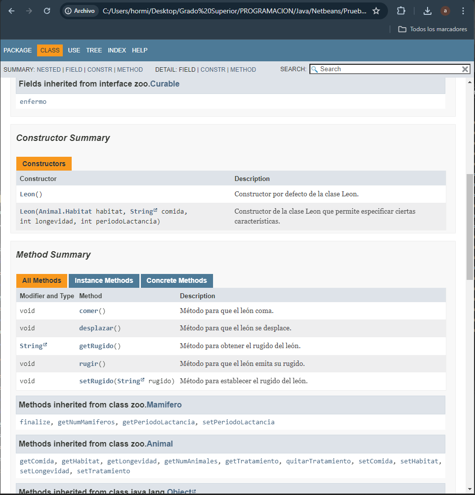
## EJERCICIO 3
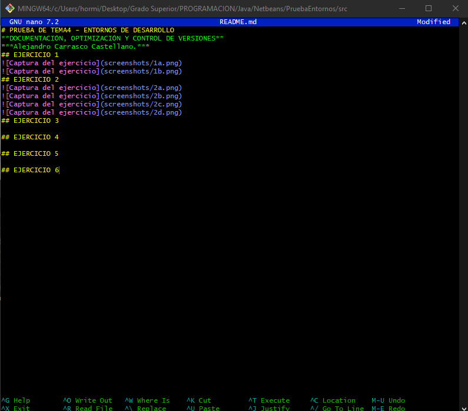
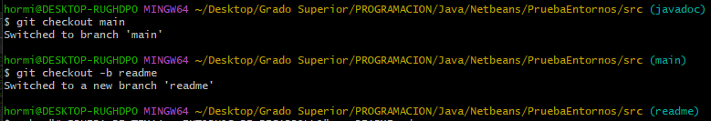
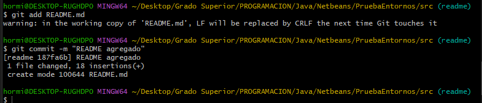
## EJERCICIO 4
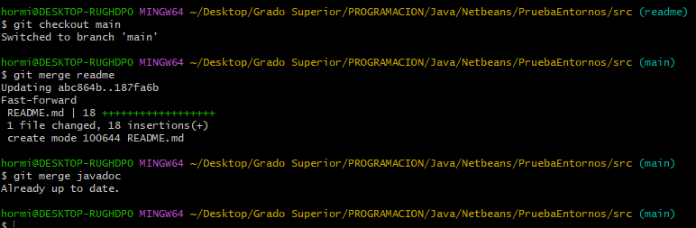
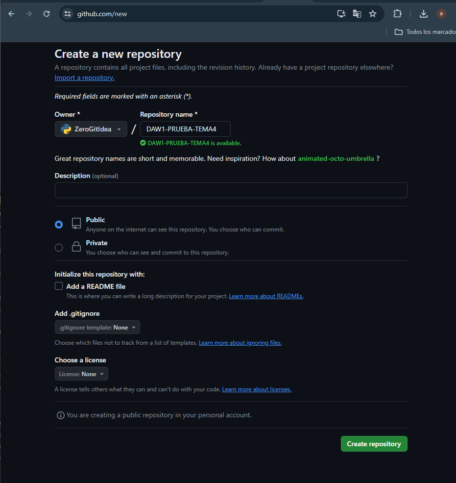
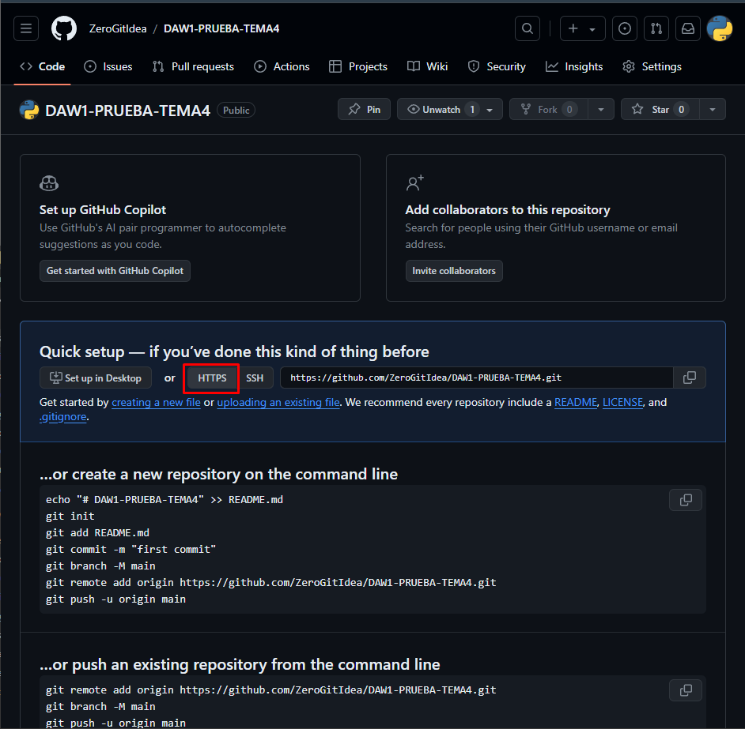
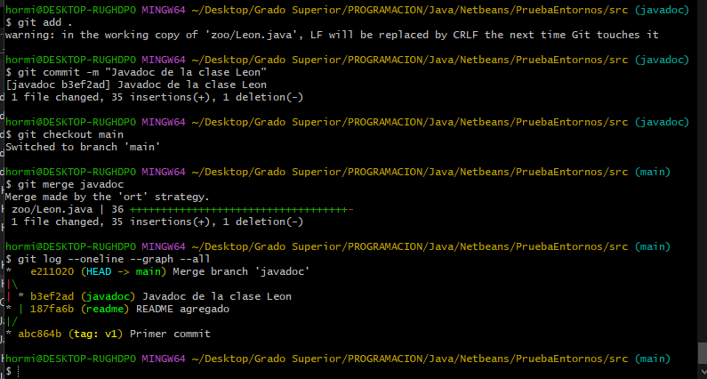
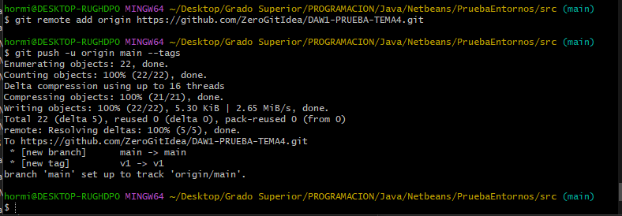
## EJERCICIO 5
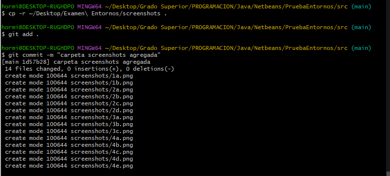
## EJERCICIO 6
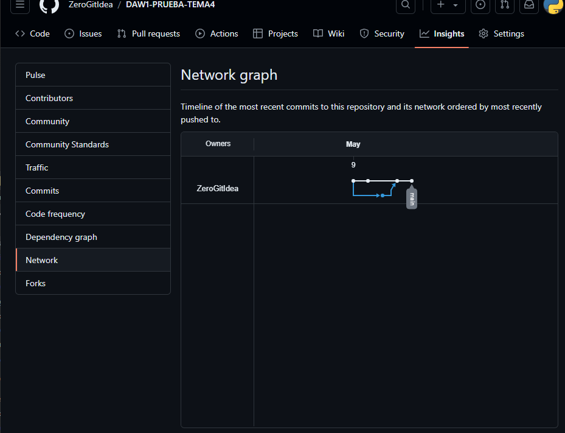
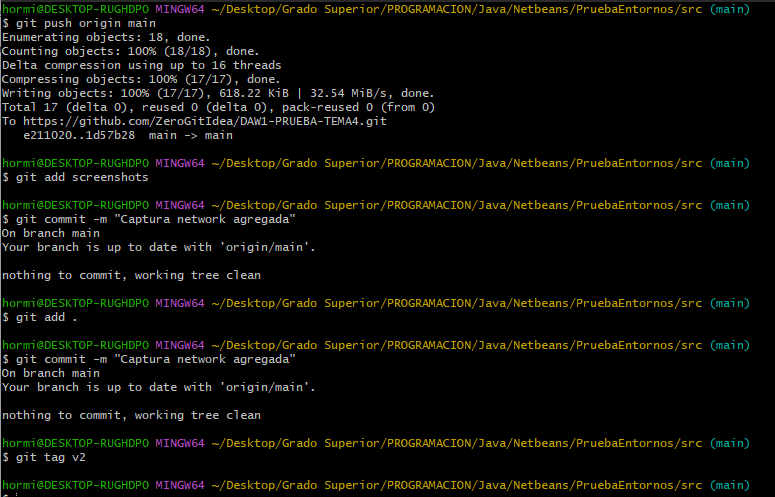
